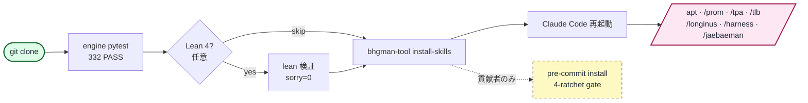

<div align="center">

# bhgman_tool

**Claude Code skill workflow のための KG-anchored agent オーケストレーション toolkit。** Lean 4 で検証された confidence schema (定理 7 個、`sorry=0`) · KG↔code drift 監査 (Python + APOC trigger、現在 warn-mode)。

<a href="https://github.com/gj3447/bhgman_tool/releases/download/v0.1.0-assets/hero.mp4"></a>

[English](README.md) | [한국어](README.ko-KR.md) | [中文](README.zh-CN.md) | [日本語](README.ja-JP.md)

[](https://github.com/gj3447/bhgman_tool#status-experimental)
[](docs/PYPI_PUBLISH_STATUS.md)
[](LICENSE)
[](https://leanprover.github.io/)
[](https://www.python.org/)
[](engine/longinus_drift_audit/tests/)
[](.pre-commit-config.yaml)

</div>

---

## 30 秒で得られるもの

```bash
# まだ PyPI 未公開 (publish 保留中) — 現在はソースからインストール:
git clone --recurse-submodules https://github.com/gj3447/bhgman_tool.git && cd bhgman_tool
uv run bhgman-tool install-skills    # /apt /prom /tpa /tlb /longinus /harness /jaebaeman を Claude Code に追加
```

Claude Code を再起動し、chat で:

```
/prom 16 "調査トピック"
# parent が haiku 16 並列 subagent を派遣、
# 各々が JSON を返し、parent が batch で knowledge graph に write、
# 全 claim に citation_url + 再現可能な cycle_id が付く。
```

揮発性の subagent run が first-class で監査可能な record に。

---

## なぜ bhgman_tool か

- **検証可能な provenance** — 全ての subagent run が KG-anchored、sha256-baselined の `ResearchFinding` ノードとして結晶化。cycle_id / axis seed / citation URL / parent-lesson edge を含む。再実行は idempotent。チャットセッションが終わっても claim が生き残る。
- **drift 監査内蔵** — Longinus 7-layer 参照モデル + sha256 baseline + 正逆 orphan scan が KG↔source-code drift を蓄積前に検出。CLI / pre-commit hook / CI job のいずれでも運用可能。
- **すぐ使える方法論 skill** — `bhgman-tool install-skills` のワンライナーで APT/TPA cycle orchestrator + 5-tool stack(Prometheus / Longinus / Naesengmoon / Jaebaeman / Harness)が Claude Code slash command として有効化。カスタム MCP wiring 不要。

---

## インストール

```bash
# ⚠ まだ PyPI 未公開 — 公開後のみ有効。それまでは上記の git clone を使用。
pip install bhgman_tool                       # 最小 (CLI + Pydantic モデル)
pip install "bhgman_tool[resolver]"           # + APT v27 resolver (Jinja2 + Neo4j)
pip install "bhgman_tool[gate]"               # + APT v27 gate endpoint (FastAPI + Redis)
pip install "bhgman_tool[all]"                # 全部
```

> **まだ PyPI 未公開**（token なしで保留中 — [docs/PYPI_PUBLISH_STATUS.md](docs/PYPI_PUBLISH_STATUS.md)）。現在 `pip install bhgman_tool` は失敗します；ソースからインストール: `git clone --recurse-submodules https://github.com/gj3447/bhgman_tool.git`。公開後の PyPI wheel は `engine/` のみ同梱。`install-skills` / `verify` / `version` subcommand は source repo(`skills/` + `lean/`)が並んで存在する必要あり — フル機能には clone。詳細は [docs/PYPI_PUBLISH.md](docs/PYPI_PUBLISH.md)。

### 測定された効能 — 何を*追加しないか* (外部 A/B, 2026-05-30)

**外部 oracle**(植えた ground truth / ライブ URL チェック — bhgman 自身の KG では*ない*)で採点し、base-LLM arm に**同等のツール予算**を与えた反証可能な A/B:

- **決定論エンジンは能力を追加しない。** sha256 drift 検出(不可視の zero-width / NBSP / homoglyph 編集を含む)と KG ノード dedup において、`longinus` / `occam` / `hades` は **F1 1.0 — だが `shasum`/推論を使う base LLM も同じく 1.0、試験した全規模(2000 ファイルまで)で**。価値は**決定論・網羅性・冪等性・署名付き audit trail** であって「モデルより賢い」ではない。
- **Grounding は効くが RAG 一般論。** 実際の検索ソースを与えると幻覚引用が **42.9% → 0%** — *検索*の価値であり、LLM + 検索なら誰でも得られる。bhgman はそれをパッケージ化するだけで発明はしない。
- **敵対的 verify-gate(`tlb`/naesengmoon)は過剰却下していた — 2026-05-30 に修正。** 以前の prompt が健全で十分に hedge された作業を flag していた(モデルが大きくなるほど precision が 0 に)。較正修正(*名指しできる*違反でのみ FAIL、誠実な hedge は通過)で **base モデルと同等 + over-claim 100% 捕捉**に回復。
- **Composition の創発は governance であって cognition ではない。** 7 軍団長 contract + oracle-gate パイプライン(`legion`)が統合失敗を、改竄検知可能な **HMAC** audit trail と共に決定論的に捕捉する — ad-hoc orchestration が既定では与えないもの — だが base モデルを超えて推論を**引き上げはしない**。

**結論: bhgman_tool は governance / audit 層(再現性・provenance・contract 強制・drift 検出)であって、能力倍増器ではない。*intelligence* ではなく *discipline* として扱うこと。**

---

## Quickstart (3 分)

```bash
git clone https://github.com/gj3447/bhgman_tool.git
cd bhgman_tool

# 1. engine — pytest 検証
uv run --all-extras pytest engine/longinus_drift_audit/tests -q   # 期待: 332 passed, 1 skipped, ~2s

# 2. Lean 4 — 形式検証 (任意)
cd ../../lean
lean Longinus_ConfidenceSchema_GraphifyAbsorbed.lean   # exit 0, sorry=0

# 3. Claude Code skill インストール
cd ../..
uv run bhgman-tool install-skills              # デフォルト: ~/.claude/skills

# 4. (貢献者のみ) pre-commit ratchet
uvx pre-commit install --hook-type pre-commit --hook-type pre-push
```

Claude Code を再起動後、`/apt` `/prom` `/tpa` `/tlb` `/longinus` `/harness` `/jaebaeman` が使用可能。全ガイド: [docs/01-quickstart.md](docs/01-quickstart.md)。



---

## 仕組み

`/apt` は 5-phase cycle(SemanticAnchor → SemanticPyramid → SemanticTwin → SourceCodeWorld → MetaReview)を統制し、各 gate で適切なツールを派遣。`/tpa` は逆方向(コード → 設計復元)。skill 派遣グラフ + Harness 4-axis / 3-tier family 図は [docs/02-concepts/skills-graph.md](docs/02-concepts/skills-graph.md)、[docs/02-concepts/harness.md](docs/02-concepts/harness.md) を参照。

---

## Claim の再現方法

README の全定量 claim にはワンコマンド検証スクリプトが付属。クリーン clone 上で実行可能:

| Claim | Command | 何を確認するか |
|---|---|---|
| `332 passed, 1 skipped` (engine 部分) | `uv run --all-extras pytest engine/longinus_drift_audit/tests -q` | engine 部分 pass count + runtime |
| `1365 passed, 4 skipped` (リポジトリ全体; 1369 collected) | `uv run --all-extras pytest -q` (または `uvx pre-commit run --all-files`) | リポジトリ全体の pass count (4 skip = キー無し clone: 実-API smoke 3 + otel no-op 1) |
| `Lean 4: proof-position sorry=0` | `cd lean && for f in *.lean; do lean "$f" \|\| exit 1; done && grep -rEn '(:=\|by) +sorry' *.lean \| wc -l` | 14 個の standalone(Mathlib-free)ファイルをビルド + 未完成の証明数(= 0；ツリー内の全 `sorry` トークンはコメント内) |
| `105 theorems` (`lean/` ツリー全体；standalone 14 ファイルで 89) | `grep -rcE '^(theorem\|lemma) ' lean/ \| awk -F: '{s+=$2} END{print s}'` | トップレベル theorem/lemma 宣言数 |
| `KG cycle reproducibility` | `bhgman-tool replay-cycle <cycle_id>` | cycle 再実行 + KG output diff |

**Goodhart 免責事項:** これらのスクリプトは*指標値の再現性*を検証するもので、*指標が測ろうとするものの妥当性*を検証するものではありません。theorem count / sorry count / pytest count は全て Goodhart 法則に対して脆弱 — 「この数字がクリーン clone から安定的に到達可能」を確認するのであって、「この数字がシステムが正しいことを意味する」を確認するわけではありません。妥当性は証明そのもの、テスト本体、cycle output に宿るのであって、count に宿るのではありません。

---

## Documentation

- [docs/01-quickstart.md](docs/01-quickstart.md) — フルセットアップ
- [docs/02-concepts/](docs/02-concepts/) — Harness、APT、TPA、5 武器
- [docs/04-references/related-work.md](docs/04-references/related-work.md) — 隣接 OSS(LangGraph、CrewAI、ruflo)との比較
- [docs/06-philosophy/](docs/06-philosophy/) — 概念的本質層、本ツールが SYMPOSIUM 十二使徒フレームワークから分離して生まれた経緯(任意読み物)

---

## Status: experimental

アーリーアダプター段階。API surface、skill contract、badge 数値はすべて deprecation cycle なしで変更される可能性あり。production 用途には specific commit pin (または `pip install bhgman_tool==<version>`) 推奨。本 README を生成した cycle (PROM 16 + 3 レンズ Naesengmoon round-2) は project KG で `EXPLORATORY_NOT_CONFIRMATORY` タグ — SYMPOSIUM monorepo の `THEORY/bhgman_tool_readme_design/PROM_16_REPORT.md` 参照。

## Contributing

Pre-commit 4-ratchet gate が毎 commit に ruff lint+format / complexipy ≤15 / deptry / 1369 pytest テストを実行、毎 push に lychee リンクチェック。インストール: `uvx pre-commit install --hook-type pre-commit --hook-type pre-push`。

---

## License

MIT. 著者: [gj3447@gmail.com](mailto:gj3447@gmail.com)。

---

<sub>SYMPOSIUM 十二使徒 / 5 武器フレームワーク内で結晶化。ツール自体は独立運用可能;概念的本質層は [docs/06-philosophy/](docs/06-philosophy/) にあり。KG provenance: `github-mirror-bhgman-2026-05-13` (`:PublicReferenceRepo:Canonical`, scope=tool-layer-only)。</sub>
