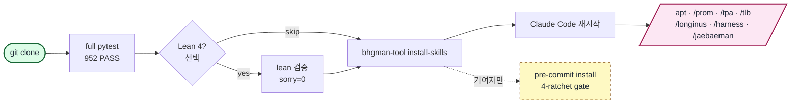

<div align="center">

# bhgman_tool

**Claude Code skill workflow를 위한 KG-anchored agent orchestration toolkit.** Lean 4로 검증된 confidence schema (정리 7개, `sorry=0`) · KG↔code drift 감사 (Python + APOC trigger, 현재 warn-mode).

<a href="https://github.com/gj3447/bhgman_tool/releases/download/v0.1.0-assets/hero.mp4"></a>

[English](README.md) | [한국어](README.ko-KR.md) | [中文](README.zh-CN.md) | [日本語](README.ja-JP.md)

[](https://github.com/gj3447/bhgman_tool#status-experimental)
[](https://pypi.org/project/bhgman_tool/)
[](LICENSE)
[](https://leanprover.github.io/)
[](https://www.python.org/)
[](engine/longinus_drift_audit/tests/)
[](.pre-commit-config.yaml)

</div>

---

## 30초 안에 얻는 것

```bash
pip install bhgman_tool
uv run bhgman-tool install-skills    # /apt /prom /tpa /tlb /longinus /harness /jaebaeman 추가
```

Claude Code 재시작 후 chat에서:

```
/prom 16 "조사할 주제"
# parent가 haiku 16개 병렬 dispatch,
# 각자 JSON 반환, parent가 batch로 knowledge graph에 write,
# 모든 claim에 citation_url + 재실행 가능한 cycle_id 남음.
```

휘발성 subagent run을 first-class, 감사 가능한 record로.

---

## 왜 bhgman_tool인가

- **검증 가능한 provenance** — 모든 subagent run이 KG-anchored, sha256-baselined `ResearchFinding` 노드로 결정화. cycle_id / axis seed / citation URL / parent-lesson edge 포함. 재실행 시 idempotent. 채팅 세션이 끝나도 claim이 살아남음.
- **drift 감사 내장** — Longinus 7-layer 참조 모델 + sha256 baseline + forward/reverse orphan scan으로 KG↔source-code drift를 누적 전에 탐지. CLI / pre-commit hook / CI job 어떤 형태로도 운용 가능.
- **즉시 쓰는 방법론 skill** — `bhgman-tool install-skills` 한 줄로 APT/TPA cycle orchestrator + 5-tool stack(Prometheus / Longinus / Naesengmoon / Jaebaeman / Harness)이 Claude Code slash command가 됨. 별도 MCP wiring 불필요.

---

## 설치

```bash
pip install bhgman_tool                       # 최소 (CLI + Pydantic 모델)
pip install "bhgman_tool[resolver]"           # + APT v27 resolver (Jinja2 + Neo4j)
pip install "bhgman_tool[gate]"               # + APT v27 gate endpoint (FastAPI + Redis)
pip install "bhgman_tool[all]"                # 전체
```

> PyPI wheel은 `engine/`만 포함. `install-skills` / `verify` / `version` subcommand는 source repo(`skills/` + `lean/`)가 옆에 있어야 함 — 전체 기능을 위해서는 clone. 자세히는 [docs/PYPI_PUBLISH.md](docs/PYPI_PUBLISH.md).

---

## Quickstart (3분)

```bash
git clone https://github.com/gj3447/bhgman_tool.git
cd bhgman_tool

# 1. engine — pytest 검증 (repo ROOT 에서 실행: 테스트가 `engine.longinus_drift_audit.*` 절대 import 를
#    쓰고, --all-extras 가 suite 의존성(예: python-frontmatter)을 끌어옴)
uv run --all-extras pytest engine/longinus_drift_audit/tests -q   # 예상: 319 passed, 1 skipped, ~2s

# 2. Lean 4 — 형식 검증 (선택)
( cd lean && lean Longinus_ConfidenceSchema_GraphifyAbsorbed.lean )   # exit 0, sorry=0

# 3. Claude Code skill 설치
uv run bhgman-tool install-skills              # 기본: ~/.claude/skills

# 4. (기여자만) pre-commit ratchet
uvx pre-commit install --hook-type pre-commit --hook-type pre-push
```

Claude Code 재시작 후 `/apt` `/prom` `/tpa` `/tlb` `/longinus` `/harness` `/jaebaeman` 사용 가능. 전체 가이드: [docs/01-quickstart.md](docs/01-quickstart.md).



---

## 어떻게 동작하나

`/apt`는 5-phase cycle (SemanticAnchor → SemanticPyramid → SemanticTwin → SourceCodeWorld → MetaReview)을 운영하고 각 gate에서 5무기를 dispatch. `/tpa`는 역방향(code → design recovery). skill-dispatch graph + Harness 4-axis / 3-tier family 다이어그램은 [docs/02-concepts/skills-graph.md](docs/02-concepts/skills-graph.md), [docs/02-concepts/harness.md](docs/02-concepts/harness.md) 참고.

---

## Claim 재현 방법

README의 모든 정량 claim에는 한 줄짜리 verifier가 붙어 있음. clean clone에서 실행 가능:

| Claim | Command | 무엇을 확인 |
|---|---|---|
| `319 passed, 1 skipped` (engine 부분) | `uv run --all-extras pytest engine/longinus_drift_audit/tests -q` (repo root) | engine 부분 pass count + runtime |
| `952 passed, 6 skipped` (전체 repo) | `uv run --all-extras pytest -q` (root, 또는 `uvx pre-commit run --all-files`) | 전체 repo pass count. NOTE: `--all-extras` 필수 — 없으면 collection 단계에서 `import frontmatter` 실패 (python-frontmatter 가 `resolver`/`all` extra 소속, 기본 deps 아님). |
| `Lean 4: proof-position sorry=0` | `cd lean && export LEAN_PATH=$PWD && for f in Measurement_MetricScale Measurement_CommanderMetrics Measurement_CompositionSafety Measurement_Phase4_EmpiricalValidation; do lean --o=$f.olean $f.lean \|\| exit 1; done && for f in *.lean; do lean "$f" \|\| exit 1; done && grep -rEn '(:=\|by) +sorry' *.lean \| wc -l` | 13개 Mathlib-free 파일 빌드(9 standalone + `Measurement_*` 4파일 sibling-import 체인, LEAN_PATH 로 의존순) + 미완성 증명 수(= 0; 트리의 모든 `sorry` 토큰은 주석 안) |
| `87 theorems` (`lean/` 트리 전체; standalone 13파일 71) | `grep -rcE '^(theorem\|lemma) ' lean/ \| awk -F: '{s+=$2} END{print s}'` | 최상위 theorem/lemma 선언 수 |
| `KG cycle reproducibility` | `bhgman-tool replay-cycle <cycle_id>` | cycle 재실행 + KG output diff |

**Goodhart disclaimer:** 이 스크립트들은 *지표 값의 재현성*을 검증하는 것이지, *그 지표가 측정하려는 것의 타당성*을 검증하는 게 아니다. theorem count / sorry count / pytest count는 모두 Goodhart-vulnerable — "이 숫자가 clean clone에서 안정적으로 도달 가능"을 확인하지, "이 숫자가 시스템이 정확하다는 의미"를 확인하지 않는다. 타당성은 증명 자체 / 테스트 본문 / cycle output에 있지 count에 있지 않다.

---

## Documentation

- [docs/01-quickstart.md](docs/01-quickstart.md) — 전체 setup
- [docs/02-concepts/](docs/02-concepts/) — Harness, APT, TPA, 5무기
- [docs/04-references/related-work.md](docs/04-references/related-work.md) — 인접 OSS(LangGraph, CrewAI, ruflo) 비교
- [docs/06-philosophy/](docs/06-philosophy/) — 개념적 본질 layer. 이 도구가 SYMPOSIUM 12-apostle framework에서 분리되어 나온 배경 (선택 독서)

---

## Status: experimental

초기 adopter 단계. API surface, skill contract, badge 숫자 모두 deprecation cycle 없이 바뀔 수 있음. production 용으로는 specific commit (또는 `pip install bhgman_tool==<version>`) pin 권장. 이 README를 만든 cycle (PROM 16 + 3중 나생문 round-2)은 project KG에 `EXPLORATORY_NOT_CONFIRMATORY` tag — SYMPOSIUM monorepo의 `THEORY/bhgman_tool_readme_design/PROM_16_REPORT.md` 참고.

## Contributing

Pre-commit 4-ratchet gate가 모든 commit에 ruff lint+format / complexipy ≤15 / deptry / 891 pytest 실행, push마다 lychee 링크 검사. 설치: `uvx pre-commit install --hook-type pre-commit --hook-type pre-push`.

---

## License

MIT. Author: [gj3447@gmail.com](mailto:gj3447@gmail.com).

---

<sub>SYMPOSIUM 12사도 / 5무기 framework 안에서 결정화됨. 도구 자체는 독립 운용; 개념적 본질 layer는 [docs/06-philosophy/](docs/06-philosophy/)에 있음. KG provenance: `github-mirror-bhgman-2026-05-13` (`:PublicReferenceRepo:Canonical`, scope=tool-layer-only).</sub>
