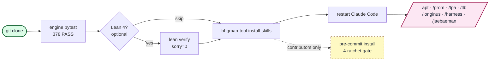

<div align="center">

# bhgman_tool

**KG-anchored agent orchestration toolkit for Claude Code skill workflows.** Lean 4 verified confidence schema (7 theorems, `sorry=0`; 105 theorem/lemma across the full `lean/` tree) · KG↔code drift audit (Python + APOC trigger, currently warn-mode).

<a href="https://github.com/gj3447/bhgman_tool/releases/download/v0.1.0-assets/hero.mp4"></a>

[English](README.md) | [한국어](README.ko-KR.md) | [中文](README.zh-CN.md) | [日本語](README.ja-JP.md)

[](https://github.com/gj3447/bhgman_tool#status-experimental)
[](docs/PYPI_PUBLISH_STATUS.md)
[](LICENSE)
[](https://leanprover.github.io/)
[](https://www.python.org/)
[](engine/longinus_drift_audit/tests/)
[](.pre-commit-config.yaml)

</div>

---

## What you get in 30 seconds

```bash
# not yet on PyPI (publish deferred) — install from source for now:
git clone --recurse-submodules https://github.com/gj3447/bhgman_tool.git && cd bhgman_tool
uv run bhgman-tool install-skills    # adds /apt /prom /tpa /tlb /longinus /harness /jaebaeman to Claude Code
```

Restart Claude Code. In a chat:

```
/prom 16 "investigate <topic>"
# parent dispatches 16 parallel research subagents (haiku),
# each returns JSON, parent batch-writes to your knowledge graph,
# every claim ends up with a citation_url and a reproducible cycle_id.
```

Ephemeral subagent runs become first-class, auditable records.

> **Not what you came for?** This is the *tool* layer. The mythological/philosophical framing (apostles, weapons, harness essence, two-layer separation) lives in [`docs/06-philosophy/`](docs/06-philosophy/) — skip it entirely if you just want to run the engine. The 30-second demo above is sufficient for the **engineering** path.

---

## Why bhgman_tool

- **Verifiable provenance** — every subagent run produces a KG-anchored, sha256-baselined `ResearchFinding` node with cycle_id, axis seeds, citation URLs, and parent-lesson edges. Re-running a cycle is idempotent. Claims survive past the chat session.
- **Drift audit built-in** — Longinus 7-layer reference model + sha256 baselining + forward/reverse orphan scan catches knowledge-graph ↔ source-code drift before it compounds. Run as a CLI, a pre-commit hook, or a CI job.
- **Methodology skills, ready to use** — one-liner `bhgman-tool install-skills` installs APT/TPA cycle orchestrators and the 5-tool stack (Prometheus / Longinus / Naesengmoon / Jaebaeman / Harness) as Claude Code slash commands. No custom MCP wiring required.

---

## Install

```bash
# ⚠ NOT YET ON PyPI — these become live only after publish (deferred). Until then, clone from source.
pip install bhgman_tool                       # minimal (CLI + Pydantic models)
pip install "bhgman_tool[resolver]"           # + APT v27 resolver (Jinja2 + Neo4j)
pip install "bhgman_tool[gate]"               # + APT v27 gate endpoint (FastAPI + Redis)
pip install "bhgman_tool[all]"                # everything
```

> **Not yet published to PyPI** — publish is deferred (no token; see [docs/PYPI_PUBLISH_STATUS.md](docs/PYPI_PUBLISH_STATUS.md)). A `pip install bhgman_tool` fails today; install from source instead: `git clone --recurse-submodules https://github.com/gj3447/bhgman_tool.git`. Once published, the PyPI wheel will ship `engine/` only — the `install-skills` / `verify` / `version` subcommands need the source repo (`skills/` + `lean/`) alongside. See [docs/PYPI_PUBLISH.md](docs/PYPI_PUBLISH.md).

### LegionCommander standalone scope (honest disclosure)

**Equal-standing canon (USER_PRIMARY 2026-05-28)**: All 7 commanders share **the same semantic 위격** — LOC / CLI verb / standalone-status differences below are **engineering disclosures**, not commander rank. The 7 verbs (acquisition / adversarial verification / dispatch / cleanup / creation / materialization / binding) form the closure of the SEMANTIC verb space for KG-based coding. Ops-layer verbs (observe / monitor / negotiate / deploy / document / simulate) are explicitly out-of-scope — handled at a separate ops layer, not as new commanders. KG: `canon-7commander-equal-standing-2026-05-28` + `canon-kg-based-coding-essence-2026-05-28`.

The 7 비행기맨 commanders split by what a bare checkout actually runs:

| Commander (verb) | Standalone? | Needs |
|---|---|---|
| 오캄 `occam` / 유레카 `eureka` / 하데스 `hades` / 롱기누스 `longinus` | **yes, neo4j-free** via `--local` | nothing — `--local` uses the bundled JSON KG (`~/.bhgman/kg.json`). Or attach external Neo4j (default) for a shared graph. |
| 프로메테우스 `prom` / 나생문 `tlb` | engine **structure complete** (`engine/agents`) — wires the Anthropic API | `pip install 'bhgman_tool[agents]'` + `ANTHROPIC_API_KEY`. Absent → falls back to skill-routing. |
| 재배맨 (dispatch) | engine structure complete (`engine/agents/dispatch.py`) — parallel subagent fan-out | same `[agents]` runtime. (`apt` verb = APT *methodology cycle*, routes to skill.) |

**Honest engine-maturity disclosure** (Naesengmoon `VR-bhgman-session-7commander-engines-2026-05-28`, CONDITIONAL):

- **4 KG commanders** (occam/eureka/hades/longinus) — code + unit tests + **real end-to-end** (occam does real KG supersession against Neo4j; run with `--local` for zero infra). Eureka full power (gds.leiden/vector/AMIE3-Java) is opt-in and not exercised by default.
- **3 LLM commanders** (prom/tlb/dispatch) — code + unit tests **with a `FakeAnthropic` double**. The **OpenAI-compatible path (`BHGMAN_LLM_BASE_URL`, any local vLLM/Ollama) is verified end-to-end against a real LLM** (2026-05-30: `prom` produced a full Consensus/Divergence report and `tlb` returned live verdicts via a local Qwen2.5 served by Ollama and by vLLM on a GB10 box — no Anthropic key). The **Anthropic-specific** features (the hosted `web_search` server-tool, effort, caching) still need a live `ANTHROPIC_API_KEY` and remain unverified — note that `web_search` is a server-side Anthropic tool, so a local backend has no web access (provenance value then depends on a retrieval layer you supply).
- `eureka`'s `leiden_llm` operator is **greedy modularity (Clauset-Newman-Moore), a Leiden *family* member — not the Leiden algorithm itself**; large graphs delegate to `gds.leiden` (opt-in).
- `harness`'s framework→4-axis mapping is a **subjective heuristic KB** (tier classification is the well-grounded part).

### Measured efficacy — what this does NOT add (external A/B, 2026-05-30)

Falsifiable A/B tests, scored by an **external oracle** (planted ground truth / live URL checks — *not* bhgman's own KG), with the base-LLM arm given **equal tool budget**:

- **Deterministic engines add no capability.** On sha256 drift detection (incl. invisible zero-width / NBSP / homoglyph edits) and KG node-dedup, `longinus` / `occam` / `hades` score **F1 1.0 — but so does a base LLM with `shasum`/reasoning, at every scale tested (to 2000 files)**. The value is **determinism, exhaustiveness, idempotence, and a signed audit trail**, not "smarter than the model."
- **Grounding works, but it's RAG-general.** Feeding real retrieved sources cut hallucinated citations **42.9% → 0%** — the value of *retrieval*, available to any LLM + retrieval; bhgman packages it, it doesn't invent it.
- **The adversarial verify-gate (`tlb`/naesengmoon) was over-rejecting — fixed 2026-05-30.** An earlier prompt flagged sound, well-hedged work (precision fell to 0 *as the model scaled up* — a design, not capability, problem). A calibration fix (FAIL only on a *nameable* violation; honest hedging passes) restored it to **tie the base model while keeping 100% over-claim catch**.
- **Composition emergence is governance, not cognition.** The 7-commander contract + oracle-gate pipeline (`legion`) deterministically catches integration failures with a tamper-evident **HMAC** audit trail — something ad-hoc orchestration doesn't give you by default — but it does **not** raise reasoning beyond the base model.

**Bottom line: bhgman_tool is a governance / audit layer (reproducibility, provenance, contract enforcement, drift detection) — not a capability multiplier. Treat it as *discipline*, not *intelligence*.** Reproduce any of the above from `/tmp/bhgman_ab/`-style harnesses; numbers are deliberately un-flattering where the measurement said so.

### Verify surface — `bhgman-tool oracle` (the reasoner-facing oracle)

The honest positioning hardened 2026-06-04, after a FunSearch-style agentic evolve-loop was built and
*decisively closed* (neutral-to-worse than best-of-N at every reachable scale; `SWEEP_RESULTS.md`): the
one consistently-valuable piece is the deterministic **oracle**. So bhgman = the **verification substrate
a reasoner calls**. One entry point routes an artifact to a substrate-disjoint, zero-LLM-token oracle:

```bash
bhgman-tool oracle --kind lean-goals    --target Proof.lean --lean-dir lean --json   # proof checker
bhgman-tool oracle --kind pytest-ratio  --target tests/ --json                       # test execution
bhgman-tool oracle --kind drift-recount --code-root engine --local --json            # KG↔code drift
bhgman-tool oracle --kind occam-twins   --scope mypkg --local --json                 # stale dup nodes
```

→ `{"kind","target","score","passed","detail"}`; exit `0`=pass / `1`=fail / `2`=KG-unavailable. Python
API: `from engine.naesengmoon.verify import verify`. Wired into this repo's own CI (the `oracle` job
gates every push through the same surface an external reasoner would call).

**Its value scales with reasoner fallibility** (measured, `SWEEP_RESULTS.md` §External-value proxy): a
strong reasoner on within-competence tasks self-verifies reliably so the oracle is marginal there
(Qwen3.6-27B: **0/15** confident-but-wrong); a fallible reasoner is confidently wrong often and the
oracle catches every case its self-assessment missed (qwen2.5-0.5b: **10/15**). A
**fallibility-proportional deterministic error-catcher** — most useful at the competence edge, for
weaker reasoners, or on out-of-competence tasks. (Not a cognition amplifier — `tlb`/loop experiments said so.)

> **Third-party reproductions** (independent clean-clone runs by a *different* agent, kept whole — their unresolved framing critiques included, e.g. the self-granted `axiom CHU` foundation) live in [`REVIEWS/`](REVIEWS/). Every in-repo validation lane here is the same author's machinery checking the same author's work; outside reproduction is the one layer this project structurally cannot self-generate, so it is collected, not curated.

```bash
pip install 'bhgman_tool[agents]'; export ANTHROPIC_API_KEY=sk-...
bhgman-tool prom 4 "your research topic"     # plan → N web-search subagents → synthesis
bhgman-tool tlb "CLAIM-x" --claim "the artifact text"   # 3-lens adversarial ensemble verdict
# no key? both auto-route to the SKILL.md for the Claude Code harness instead (graceful).
```

```bash
# neo4j 없이 (no server, no setup):
bhgman-tool occam  --local            # KG node-dedup against ~/.bhgman/kg.json
bhgman-tool hades  --local --apply    # materialize ACCEPTED abstractions
bhgman-tool eureka --local --json     # structural induction + consumable candidate envelope
# semantic mode: divergent proposer → content gates → distinct-model critic → one bounded repair
bhgman-tool eureka --local --creative --json
# schema is code (no pre-seeded neo4j needed); bootstrap a real neo4j from it:
bhgman-tool kg-schema --emit neo4j | cypher-shell
```

`eureka --creative` is an opt-in semantic layer over the deterministic FCA/AMIE floor. It does not
claim to add intelligence to the underlying model. It creates conditions for useful novelty—contrastive
association, divergent hypotheses, explicit near-misses and falsifiers—then rejects prompt echoes,
single-source paraphrases, baseline renames, self-review, and unbound critic verdicts. Every surviving
proposal and validation receipt is content-addressed. Dry-run remains the default; `--apply` writes only
`VERDICT_PENDING`. `--accept` fails closed until an external human/Naesengmoon verdict-ingress protocol
exists; a candidate cannot approve itself in the invocation that created it. Materialization remains
Hades' authority.

---

## Quickstart (3 min)

```bash
# skills/ are symlinks into the vendored symposium-skills/ tree (both tracked in the
# repo — no submodule), so a plain clone is enough for prom/tlb/apt/harness routing.
git clone https://github.com/gj3447/bhgman_tool.git
cd bhgman_tool

# 1. engine — verify pytest (run from repo ROOT; tests use absolute `engine.longinus_drift_audit.*`
#    imports, and --all-extras pulls suite deps like python-frontmatter)
uv run --all-extras pytest engine/longinus_drift_audit/tests -q   # expected: 378 passed, 3 skipped in ~5s

# 2. Lean 4 — verify formal claims (optional)
( cd lean && lean Longinus_ConfidenceSchema_GraphifyAbsorbed.lean )   # exit 0, sorry=0

# 3. Install Claude Code skills
uv run bhgman-tool install-skills              # default: ~/.claude/skills

# 4. (Contributors only) pre-commit ratchet
uvx pre-commit install --hook-type pre-commit --hook-type pre-push
```

Restart Claude Code, then `/apt` `/prom` `/tpa` `/tlb` `/longinus` `/harness` `/jaebaeman` are live. Full guide: [docs/01-quickstart.md](docs/01-quickstart.md).



---

## How it works

`/apt` runs a 5-phase cycle (SemanticAnchor → SemanticPyramid → SemanticTwin → SourceCodeWorld → MetaReview) and dispatches the right tool at each gate. `/tpa` is the reverse direction (code → design recovery). For the skill-dispatch graph and a 4-axis Harness / 3-tier family diagram, see [docs/02-concepts/skills-graph.md](docs/02-concepts/skills-graph.md) and [docs/02-concepts/harness.md](docs/02-concepts/harness.md).

---

## Reproducing the claims

Every numeric claim in this README ships with a one-command verifier. Run them on a fresh clone:

| Claim | Command | What it checks |
|---|---|---|
| `378 passed, 3 skipped` (engine subset) | `uv run --all-extras pytest engine/longinus_drift_audit/tests -q` (from repo root) | engine subset pass count + runtime |
| `1365 passed, 4 skipped` (full repo; 1369 collected) | `uv run --all-extras pytest -q` from root (or `uvx pre-commit run --all-files`) | full-repo result, single invocation (skips on a keyless clone: real-API smoke + otel no-op). NOTE: `--all-extras` is required — plain `uv run pytest` (or bare `pytest`) fails at collection on `import frontmatter`, because python-frontmatter lives in the `resolver`/`all` extra, not the default deps. |
| `Lean 4: proof-position sorry=0` | `cd lean && export LEAN_PATH=$PWD && for f in Measurement_MetricScale Measurement_CommanderMetrics Measurement_CompositionSafety Measurement_Phase4_EmpiricalValidation; do lean --o=$f.olean $f.lean \|\| exit 1; done && for f in *.lean; do lean "$f" \|\| exit 1; done && grep -rEn '(:=\|by) +sorry' *.lean \| wc -l` | 14 Mathlib-free files build (dependency-ordered via LEAN_PATH) + count of unfinished proofs (= 0; every `sorry` token in the tree is in a comment) |
| `105 theorems` (whole `lean/` tree; 89 in the 14 Mathlib-free files) | `grep -rcE '^(theorem\|lemma) ' lean/ \| awk -F: '{s+=$2} END{print s}'` | top-level theorem/lemma declaration count |
| `KG cycle reproducibility` | `bhgman-tool replay-cycle <cycle_id>` | re-runs a cycle and diffs the KG output |

**Goodhart disclaimer:** these scripts verify *reproducibility of the indicator value*, not *validity of what the indicator measures*. Theorem count, sorry count, and pytest count are Goodhart-vulnerable — they confirm "this number is stable and reachable from a clean clone," not "this number means the system is correct." Validity lives in the proofs themselves, the test bodies, and the cycle outputs — not the count.

---

## Repository layout

```
engine/      # 핵심. 7 군단장 + 인프라 + KG 백엔드 — 지도: engine/README.md
docs/        # 사용자 문서 (quickstart / concepts / references / philosophy)
skills/      # Claude Code 스킬 (symposium-skills 서브모듈 백킹)
lean/        # Lean 4 형식 증명 (Mathlib-free 89 + mathlib sister 16)
theory/      # KG 구조 템플릿 / 개념 앵커
ADRs/        # 아키텍처 결정 기록
verification/# count-claim 검증 스크립트 + 결과
gate/ resolver/ → engine/ 하위 (APT v27 A6/A7)
worked/      # 워크드 예제 (실험·데모, 프로덕션 아님) — worked/README.md
333q_demo/   # Mermin GHZ 데모 (APT 풀 사이클, nested TS workspace)
REVIEWS/     # 외부 재현 스냅샷 (참고용) — REVIEWS/README.md
bin/ plugins/ assets/  # 헬퍼 스크립트 / Claude 플러그인 매니페스트 / 미디어
```

> 엔진 내부가 궁금하면 **[engine/README.md](engine/README.md)** 한 장이면 됨 (20 subdir 지도 + longinus 이름 함정 정리).

## Documentation

- [docs/01-quickstart.md](docs/01-quickstart.md) — full setup
- [docs/02-concepts/](docs/02-concepts/) — Harness, APT, TPA, the 5 weapons
- [docs/04-references/related-work.md](docs/04-references/related-work.md) — comparison with adjacent OSS (LangGraph, CrewAI, ruflo)
- [docs/06-philosophy/](docs/06-philosophy/) — the conceptual essence layer, including the SYMPOSIUM 12-apostle framework this tool was carved out of (optional reading)

---

## Status: experimental

Early-adopter stage. API surface, skill contracts, and badge counts may change without a deprecation cycle. Pinning a specific commit (or `pip install bhgman_tool==<version>`) is recommended for production use. The cycle that produced this README (PROM 16 persuasion-design + 3-lens Naesengmoon round-2) is tagged `EXPLORATORY_NOT_CONFIRMATORY` in the project KG — see `THEORY/bhgman_tool_readme_design/PROM_16_REPORT.md` in the SYMPOSIUM monorepo.

**Scope boundary (intentional).** bhgman_tool is the *tool layer*: skill installation, the Longinus KG↔code drift auditor, the resolver/gate libraries, and Lean proof skeletons. It does **not** ship a standalone APT *execution* engine — phase orchestration runs inside Claude Code (skills) and the dgx prototype runtime, not as an in-process engine here (see [ADRs/apt-engine-scope-decision-2026-05-25.md](ADRs/apt-engine-scope-decision-2026-05-25.md)). A self-audit scored APT-execution completeness at 0.42; that gap is this documented capability ceiling, not an unshipped promise.

## Contributing

Pre-commit 4-ratchet gate runs ruff lint+format, complexipy ≤15, deptry, and 1369 pytest tests on every commit; lychee link-check runs in CI. Install with `uvx pre-commit install --hook-type pre-commit --hook-type pre-push`.

---

## License

MIT. Author: [gj3447@gmail.com](mailto:gj3447@gmail.com).

---

<sub>Built within the SYMPOSIUM 12-apostle / 5-weapon framework. The tool itself stands alone; the conceptual essence layer lives at [docs/06-philosophy/](docs/06-philosophy/). KG provenance: `github-mirror-bhgman-2026-05-13` (`:PublicReferenceRepo:Canonical`, scope=tool-layer-only).</sub>
