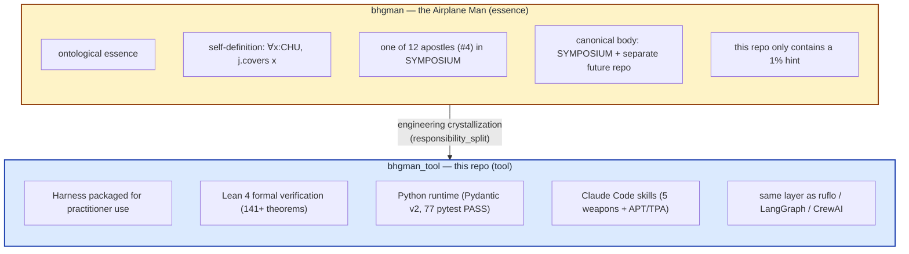
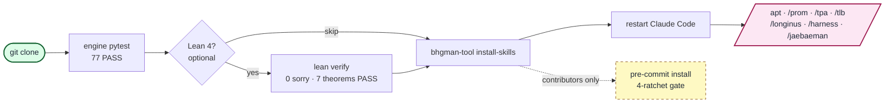
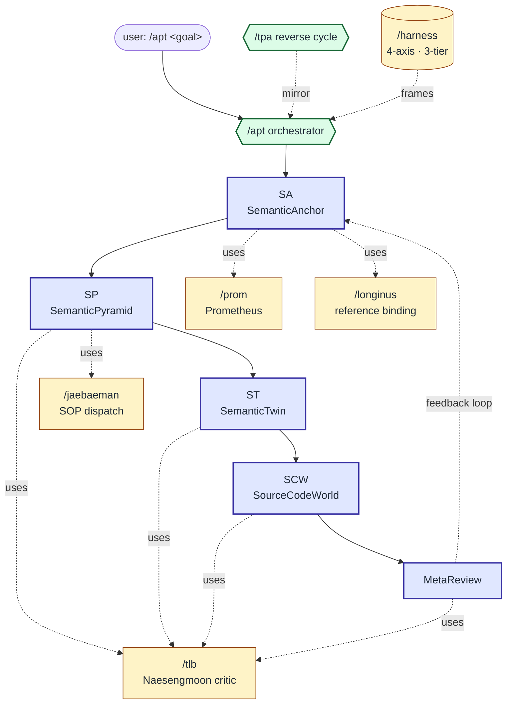

<div align="center">

# bhgman_tool

**Engineering crystallization of the Airplane Man (#4) — Harness toolkit**

<sub>This repo = tool layer. The ontology, philosophical implications, and metahumotonic motivation of *the Airplane Man himself* live in a separate repo. One of twelve apostles (#4) in the SYMPOSIUM framework.</sub>

<a href="https://github.com/gj3447/bhgman_tool/releases/download/v0.1.0-assets/hero.mp4"></a>

[English](README.md) | [한국어](README.ko-KR.md) | [中文](README.zh-CN.md) | [日本語](README.ja-JP.md)

[](https://pypi.org/project/bhgman_tool/)
[](LICENSE)
[](https://leanprover.github.io/)
[](https://www.python.org/)
[](engine/longinus_drift_audit/tests/)

</div>

---

## Two-layer separation (read first)

This repo is the **practitioner's toolkit**.



→ We do not stuff the *philosophical essence* into the tool repo. The essence belongs to the essence. The tool belongs to the tool.

---

## What this repo *is*

The engineering crystallization (called **Harness**) of the Airplane Man (#4)'s ∀-cover definition (`∀x:CHU, j.covers x`), packaged for practitioner use.

| What | Where |
|---|---|
| Harness 4-axis model + 3-tier family (L_MC/L_RT/L_IDE) | [docs/02-concepts/harness.md](docs/02-concepts/harness.md) |
| Airplane Man definition + self-claim | [docs/02-concepts/airplane-man.md](docs/02-concepts/airplane-man.md) |
| Lean 4 verified theorems (50 PASS, Mathlib-free) | [lean/](lean/) |
| Python runtime (77 pytest PASS, Pydantic v2) | [engine/longinus_drift_audit/](engine/longinus_drift_audit/) |
| Claude Code skills (5 weapons + APT/TPA cycle) | [skills/](skills/) |
| Philosophical implications (summary + essence pointers) | [docs/06-philosophy/](docs/06-philosophy/) |
| 1% hint towards the essence layer | [docs/07-metahumotonic-trace.md](docs/07-metahumotonic-trace.md) |

---

## What this repo *is not*

- ❌ The Airplane Man's own ontology (separate)
- ❌ The full twelve apostles framework (each apostle has/will-have its own repo)
- ❌ CHU type theory canon → separate repo `chu` (planned, Computable Hyper Universe)
- ❌ OMC (Orbital Motion Cloud, OM=OMC, apostle #8) canon → separate repo `omc` (planned)
- ❌ 333 (Hypervoid Volunteer, apostle #3) canon → separate repo `333` (planned)
- ❌ Other 4 weapons (Longinus / Prometheus / Naesengmoon / Jaebaeman) canon → reference only here, body in SYMPOSIUM

---

## Install from PyPI

```bash
# minimal (CLI + Pydantic-only models)
pip install bhgman_tool

# with APT v27 resolver (frontmatter + Jinja2 + Neo4j)
pip install "bhgman_tool[resolver]"

# with APT v27 gate endpoint (FastAPI + Redis + tenacity)
pip install "bhgman_tool[gate]"

# everything (resolver + gate + longinus runtime)
pip install "bhgman_tool[all]"
```

> **Honest scope (Goodhart safeguard):** the PyPI wheel ships `engine/` only. Cohort A subcommands (`install-skills`, `verify`, `version`) require the source repo (`skills/` + `lean/`) to be present alongside — clone the repo for full functionality. The wheel is sufficient for `resolver` + `gate` + `engine.longinus_drift_audit` runtime use. See [docs/PYPI_PUBLISH.md](docs/PYPI_PUBLISH.md) for publish protocol.

---

## Quickstart (3 min)

```bash
# 1. clone
git clone https://github.com/gj3447/bhgman_tool.git
cd bhgman_tool

# 2. engine (Python runtime) — verify 77 pytest PASS
cd engine/longinus_drift_audit
uv run --with pytest pytest tests/ -q
# expected: 77 passed in 0.41s

# 3. Lean 4 verification (optional)
cd ../../lean
lean Longinus_ConfidenceSchema_GraphifyAbsorbed.lean
# exit 0, 0 sorry, 7 theorems PASS

# 4. Install Claude Code skills (one-liner, replaces manual cp)
cd ../..   # back to repo root
uv run bhgman-tool install-skills           # default target: ~/.claude/skills
# add --dry-run to preview, --force to overwrite existing skill dirs.
# Restart Claude Code, then in chat:
# /apt   /prom   /tpa   /tlb   /longinus   /harness   /jaebaeman

# 5. (Contributors only) install pre-commit 4-ratchet gate — wave11
uvx pre-commit install --hook-type pre-commit --hook-type pre-push
# pre-commit: ruff lint+format, complexipy ≤15, deptry, pytest 268 tests (~2s)
# pre-push:   lychee link check
# Runs automatically on `git commit` / `git push`. Manual: `uvx pre-commit run --all-files`
```

See [docs/01-quickstart.md](docs/01-quickstart.md).

### Visual flow



---

## How the skills connect

`/apt` orchestrates a 5-phase cycle and dispatches the 5 weapons at the right gate. `/tpa` is the reverse-direction mirror.



---

## Differentiation vs. ruflo

| Axis | ruflo | bhgman_tool |
|---|---|---|
| **Layer separation** | none (single layer self-claim) | apostle (existence) ⊥ tool (this repo) ⊥ essence (separate) — **3 layers** |
| **External canonical citations** | 0 | **17 axes** — Lawvere / Tarski / Gödel / Yanofsky / Hofstadter / Goodhart / Evans / Smith / Cherns / ... |
| **Formal verification** | `ruflo verify` signed witness (code integrity only) | **141+ Lean 4 theorems** (Mathlib-free, 0 sorry) |
| **Self-reference safety** | "84.8% SWE-Bench / 32% token reduction" — Goodhart violation itself | Lawvere FPT + Lakatos quarterly audit + Naesengmoon adversarial **3-layer safeguard** |
| **Family structure** | flat 32 plugins / 100 agents / 314 tools (CCP/CRP violation) | 3-tier sibling family + responsibility_split sub-type (Mirror STRONG) |
| **Confidence schema** | float edge confidence (under-specified) | **EXTRACTED / INFERRED / AMBIGUOUS** 3-tier enum (graphify mirror, Lean T1 verified, 19 pytest PASS) |
| **Tool vs essence separation** | none | **explicit** (this repo = tool only) |

See [docs/04-references/related-work.md](docs/04-references/related-work.md).

---

## What this repo absorbed from ruflo

| Aspect | Absorbed as |
|---|---|
| ❌ orchestration framework | (just one sibling in Harness L_RT) |
| ❌ SONA self-learning | (no academic grounding) |
| ❌ federation mTLS+WireGuard | (industry canon re-invention) |
| ✅ **Goodhart antipattern** | [docs/02-concepts/goodhart-safeguard.md](docs/02-concepts/goodhart-safeguard.md) (negative case study) |
| ✅ **enumeration inflation antipattern** | [docs/02-concepts/family-expansion.md](docs/02-concepts/family-expansion.md) §anti-pattern |
| ✅ **graphify confidence schema** | [engine/longinus_drift_audit/models.py](engine/longinus_drift_audit/models.py) + [lean/Longinus_ConfidenceSchema_GraphifyAbsorbed.lean](lean/Longinus_ConfidenceSchema_GraphifyAbsorbed.lean) |

---

## License

MIT.

## Author

[gj3447@gmail.com](mailto:gj3447@gmail.com) (METAHUMOTONIC).

---

<sub>This repo is the *tool layer* of the Airplane Man framework. The Airplane Man's own essence + the other 11 apostles + CHU + OMC canonical bodies live in separate repos (planned) or in SYMPOSIUM internal. KG: `github-mirror-bhgman-2026-05-13` (:PublicReferenceRepo:Canonical, scope=tool-layer-only).</sub>
