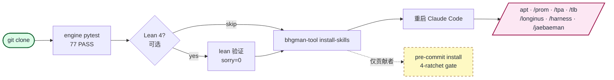

<div align="center">

# bhgman_tool

**一个 KG 锚定 + Lean 验证的 drift 审计工具,为 Claude Code skill workflow 设计的 agent orchestration toolkit。**

<a href="https://github.com/gj3447/bhgman_tool/releases/download/v0.1.0-assets/hero.mp4"></a>

[English](README.md) | [한국어](README.ko-KR.md) | [中文](README.zh-CN.md) | [日本語](README.ja-JP.md)

[](https://pypi.org/project/bhgman_tool/)
[](LICENSE)
[](https://leanprover.github.io/)
[](https://www.python.org/)
[](engine/longinus_drift_audit/tests/)

</div>

---

## 30 秒内可获得

```bash
pip install bhgman_tool
uv run bhgman-tool install-skills    # 添加 /apt /prom /tpa /tlb /longinus /harness /jaebaeman 到 Claude Code
```

重启 Claude Code,在 chat 中:

```
/prom 16 "调研主题"
# parent 派发 16 个 haiku 并行 subagent,
# 各自返回 JSON,parent 批量写入 knowledge graph,
# 每个 claim 都带有 citation_url + 可复现的 cycle_id。
```

短暂的 subagent run 变为一等公民、可审计的 record。

---

## 为什么选择 bhgman_tool

- **可验证的 provenance** — 每次 subagent run 都产生 KG 锚定、sha256 基线的 `ResearchFinding` 节点,含 cycle_id、axis seed、citation URL、parent-lesson edge。重跑幂等。会话结束后 claim 仍在。
- **内建 drift 审计** — Longinus 7-layer 引用模型 + sha256 基线 + 正反向 orphan 扫描,在 drift 累积前发现 KG↔source-code 偏差。可作 CLI、pre-commit hook 或 CI job 运行。
- **即用的方法论 skill** — `bhgman-tool install-skills` 一行命令安装 APT/TPA cycle orchestrator + 5-tool 堆栈(Prometheus / Longinus / Naesengmoon / Jaebaeman / Harness)为 Claude Code slash command。无需自定义 MCP wiring。

---

## 安装

```bash
pip install bhgman_tool                       # 最小 (CLI + Pydantic 模型)
pip install "bhgman_tool[resolver]"           # + APT v27 resolver (Jinja2 + Neo4j)
pip install "bhgman_tool[gate]"               # + APT v27 gate endpoint (FastAPI + Redis)
pip install "bhgman_tool[all]"                # 全部
```

> PyPI wheel 仅包含 `engine/`。`install-skills` / `verify` / `version` subcommand 需要 source repo(`skills/` + `lean/`)同时存在 — 完整功能需 clone。详见 [docs/PYPI_PUBLISH.md](docs/PYPI_PUBLISH.md)。

---

## Quickstart (3 分钟)

```bash
git clone https://github.com/gj3447/bhgman_tool.git
cd bhgman_tool

# 1. engine — pytest 验证
cd engine/longinus_drift_audit
uv run --with pytest pytest tests/ -q          # 预期: 77 passed, ~0.4s

# 2. Lean 4 — 形式验证 (可选)
cd ../../lean
lean Longinus_ConfidenceSchema_GraphifyAbsorbed.lean   # exit 0, sorry=0

# 3. Claude Code skill 安装
cd ../..
uv run bhgman-tool install-skills              # 默认: ~/.claude/skills

# 4. (仅贡献者) pre-commit ratchet
uvx pre-commit install --hook-type pre-commit --hook-type pre-push
```

重启 Claude Code,之后 `/apt` `/prom` `/tpa` `/tlb` `/longinus` `/harness` `/jaebaeman` 即可使用。完整指南: [docs/01-quickstart.md](docs/01-quickstart.md)。



---

## 它是如何工作的

`/apt` 编排 5 阶段 cycle(SemanticAnchor → SemanticPyramid → SemanticTwin → SourceCodeWorld → MetaReview),在每个 gate 派发合适的工具。`/tpa` 是反向(代码 → 设计还原)。skill 派发图 + Harness 4-axis / 3-tier family 图详见 [docs/02-concepts/skills-graph.md](docs/02-concepts/skills-graph.md)、[docs/02-concepts/harness.md](docs/02-concepts/harness.md)。

---

## 复现 claim

README 中所有定量 claim 都附有一条命令验证器。在干净的 clone 上运行:

| Claim | Command | 检查什么 |
|---|---|---|
| `77 pytest PASS` | `cd engine/longinus_drift_audit && uv run --with pytest pytest -q` | pass count + runtime |
| `Lean 4: sorry=0, build=OK` | `cd lean && lake build && grep -rn 'sorry' src/ \| wc -l` | 证明骨架完整性 |
| `141+ theorems` | `cd lean && grep -rcE '^(theorem\|lemma) ' src/` | 顶级 theorem 数量 |
| `KG cycle reproducibility` | `bhgman-tool replay-cycle <cycle_id>` | 重跑 cycle 并 diff KG output |

**Goodhart 声明:** 这些脚本验证的是*指标值的可复现性*,不是*指标所要度量之物的有效性*。theorem count / sorry count / pytest count 都易受 Goodhart 法则影响 — 它们确认"这个数字在 clean clone 上稳定可达",而非"这个数字意味着系统是正确的"。有效性在于证明本体、测试主体、cycle 输出,不在 count 里。

---

## Documentation

- [docs/01-quickstart.md](docs/01-quickstart.md) — 完整 setup
- [docs/02-concepts/](docs/02-concepts/) — Harness、APT、TPA、5 武器
- [docs/04-references/related-work.md](docs/04-references/related-work.md) — 与相邻 OSS(LangGraph、CrewAI、ruflo)对比
- [docs/06-philosophy/](docs/06-philosophy/) — 概念本质层,以及本工具是从 SYMPOSIUM 十二使徒框架中分离出来的背景(可选阅读)

---

## Contributing

Pre-commit 4-ratchet gate 在每次 commit 运行 ruff lint+format / complexipy ≤15 / deptry / 268 个 pytest,每次 push 运行 lychee 链接检查。安装: `uvx pre-commit install --hook-type pre-commit --hook-type pre-push`。

---

## License

MIT. 作者: [gj3447@gmail.com](mailto:gj3447@gmail.com)。

---

<sub>在 SYMPOSIUM 十二使徒 / 5 武器框架内结晶。工具本身独立可用;概念本质层位于 [docs/06-philosophy/](docs/06-philosophy/)。KG provenance: `github-mirror-bhgman-2026-05-13` (`:PublicReferenceRepo:Canonical`, scope=tool-layer-only)。</sub>
