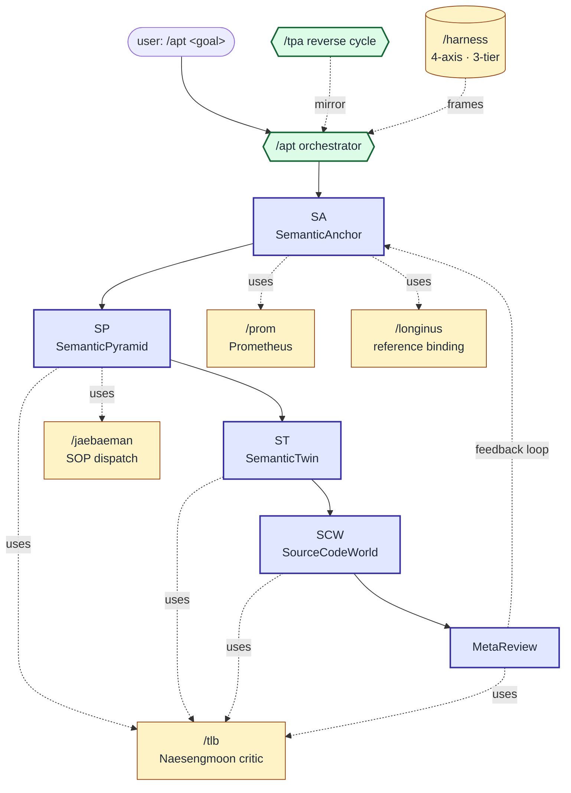

# Skills connection graph

How the slash commands dispatch each other within an APT cycle. Moved here from root README per PROM 16 README persuasion design cycle 2026-05-22 (reconciliation R4 — keep root README focused on adopter funnel; deep concept material lives under `docs/02-concepts/`).

---

## APT 5-phase cycle + tool dispatch

`/apt` orchestrates a forward design cycle (SemanticAnchor → SemanticPyramid → SemanticTwin → SourceCodeWorld → MetaReview). At each gate it dispatches one or more of the 5 tools (`/prom`, `/longinus`, `/jaebaeman`, `/tlb`, `/harness`). `/tpa` is the reverse-direction mirror (code → design recovery).

---

## Per-tool entry points

| Slash command | Tool | Phase it most commonly enters at | Deep doc |
|---|---|---|---|
| `/prom` | Prometheus (parallel research) | SA (Step 1 knowledge ingestion) | [../skills/prometheus/SKILL.md](../../skills/prometheus/SKILL.md) |
| `/longinus` | Longinus reference binding | SA Step 2 (KG ↔ code drift audit) | [../skills/longinus/SKILL.md](../../skills/longinus/SKILL.md) |
| `/jaebaeman` | Jaebaeman SOP (subagent dispatch) | SP Step 4 (D(S) parallel decomposition) | [../skills/jaebaeman/SKILL.md](../../skills/jaebaeman/SKILL.md) |
| `/tlb` | Naesengmoon adversarial critic | SP / ST / SCW / MetaReview gates | [../skills/taliban/SKILL.md](../../skills/taliban/SKILL.md) |
| `/harness` | Harness 4-axis diagnostic | Framing layer (Inform / Constrain / Verify / Correct) | [harness.md](harness.md) |
| `/tpa` | Reverse APT cycle | Reverse design recovery from existing code | [apt-tpa-cycles.md](apt-tpa-cycles.md) |

---

## See also

- [harness.md](harness.md) — 4-axis Harness model + 3-tier family (IDE-host / runtime / managed cloud)
- [apt-tpa-cycles.md](apt-tpa-cycles.md) — forward APT vs reverse TPA cycle, gate hooks
- [../06-philosophy/](../06-philosophy/) — why this tool structure rather than a flat orchestration framework
