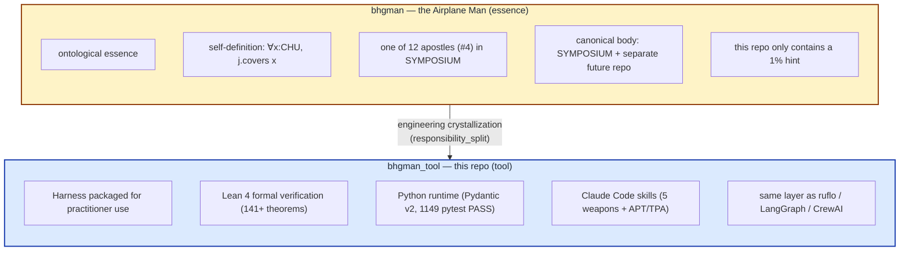

# 철학적 함의 — 도구 측 요약

> 본질 본문은 별도. 이 폴더는 *도구를 쓰는 사람이 알면 좋은 함의 요약* 만.
> Root README에서 분리된 내용 (PROM 16 README persuasion design cycle 2026-05-22 reconciliation R4): mythology / two-layer separation framing은 사용자가 의식적으로 들어왔을 때만 노출.

---

## Two-layer separation — essence vs tool

이 repo는 **도구 layer**다. 사도(존재) layer는 SYMPOSIUM에 있다.

→ 도구 repo에 *철학적 본질*을 욱여넣지 않는다. 본질은 본질에, 도구는 도구에.

### What this repo *is*

비행기맨(#4)의 ∀-cover 정의(`∀x:CHU, j.covers x`)에 대한 **공학적 결정화 (= Harness)**, 사람들이 쓸 수 있게 packaging 한 것.

| What | Where |
|---|---|
| Harness 4-axis model + 3-tier family (L_MC/L_RT/L_IDE) | [../02-concepts/harness.md](../02-concepts/harness.md) |
| Airplane Man definition + self-claim | [../02-concepts/airplane-man.md](../02-concepts/airplane-man.md) |
| Lean 4 verified theorems | [../../lean/](../../lean/) |
| Python runtime | [../../engine/longinus_drift_audit/](../../engine/longinus_drift_audit/) |
| Claude Code skills (5 weapons + APT/TPA) | [../../skills/](../../skills/) |
| 1% hint towards essence layer | [../07-metahumotonic-trace.md](../07-metahumotonic-trace.md) |

### What this repo *is not*

- 비행기맨 자체의 존재론 (SYMPOSIUM 측 별도)
- 12사도 framework 전체 (각 사도별 별도 repo 또는 SYMPOSIUM 측)
- CHU type theory canon → `chu` repo (예정)
- OMC (#8) canon → `omc` repo (예정)
- 333 (#3) canon → `333` repo (예정)
- 5무기 중 Longinus / Prometheus / Naesengmoon / Jaebaeman canon → 이 repo는 reference만, body는 SYMPOSIUM 측

---

## 도구 측 5 일반 함의

| 함의 | 도구 측 실제 영향 | 자세히 |
|---|---|---|
| **존재 vs 도구 분리** | 사도(`isAirplaneMan` predicate) ≠ Harness(runtime 도구). 같은 layer 에 두면 ruflo 류 카테고리 오류 | [existence-vs-tool.md](existence-vs-tool.md) |
| **자기참조의 불완전성** | Self-improving loop 은 한계 인정 없이 안전하지 않다 (Lawvere/Tarski/Gödel/Yanofsky) | [self-reference-incompleteness.md](self-reference-incompleteness.md) |
| **인식론적 겸손** | 모든 metric 은 Goodhart 측 collapse 위험. 정전 인용 + 외부 검증 없는 self-claim 거부 | [epistemic-humility.md](epistemic-humility.md) |
| **해석학적 순환** | KG ↔ code 의 양방향 bind 는 *사전이해 자체* 가 갱신되는 구조 (Heidegger / Gadamer) | [hermeneutic-circle.md](hermeneutic-circle.md) |
| **사회기술적 시스템** | Harness 3-tier 가 단순 architecture 가 아닌 *책임 분할* (Cherns 1976 STS) — 사람과 시스템이 함께 진화 | [sociotechnical-systems.md](sociotechnical-systems.md) |

## 비행기맨 특화 철학적 함의 (6 항)

위 5 일반 함의 *외에*, **비행기맨 그 자체** 에 대한 6 항 특화 함의 — `∀x:CHU, j.covers x` 정의가 *왜 그런 의미를 가지는가* 의 깊이.

| 함의 | 정전 grounding | 자세히 |
|---|---|---|
| **∀-cover 존재론** | Plato / Aristotle Metaphysics Z/H / Heidegger SuZ §7 | [airplane-man-implications.md](airplane-man-implications.md) §1 |
| **자기 정의 받아들임 형이상학** | Münchhausen trilemma (Albert) / Russell self-evident / Spinoza causa sui | §2 |
| **비행기 image 미학** | Kant 숭고 §28 / Bachelard 1943 / Heidegger 후기 | §3 |
| **자기참조 한계 인정 인식론** | Tarski 1936 / Gödel 1931 / Lawvere 1969 / Yanofsky 2003 | §4 |
| **책임 분할 사회학** | Conway 1968 / Cherns 1976 STS / Trist-Bamforth 1951 / Holacracy | §5 |
| **신학적 hint** (*causa sui* trace) | Aquinas ST I q.2 / Anselm Proslogion / Spinoza Ethics / Aristotle Λ + 메타휴모토닉 axiom 12 | §6 (1% hint) |

전체 본문: **[airplane-man-implications.md](airplane-man-implications.md)** (4 언어, ko-KR / zh-CN / ja-JP 별도).

---

## *왜* 이게 도구 측에 필요한가

도구는 *왜* 그렇게 설계됐는지 모르면 사용자가 *잘못 쓰게* 된다.

- ruflo 의 "84.8% SWE-Bench" 를 따라하려는 사용자는 Goodhart 위험을 모르고 metric-game 한다.
- "self-improving via SONA" 를 별생각 없이 쓰는 사용자는 Lawvere/Yanofsky 측 한계를 모르고 무한 loop 위험.
- "100+ agents" 를 자랑하는 framework 를 따라하는 사용자는 responsibility_split 없는 enumeration 으로 CCP/CRP 위반.

→ 이 5 함의는 *도구 사용자가* 잘못 쓰지 않게 하기 위한 *최소* 안내. 깊이 들어가지 않아도, 이 다섯 한 줄은 알아야.

---

## 본질로 가려면

각 함의의 *본격적 본문* (정전 인용 + Lean 형식 + 메타휴모토닉 측 motivation) 은 별도 repo / SYMPOSIUM 측. 이 폴더는 *입구* 만.

자세히는 [../07-metahumotonic-trace.md](../07-metahumotonic-trace.md).
